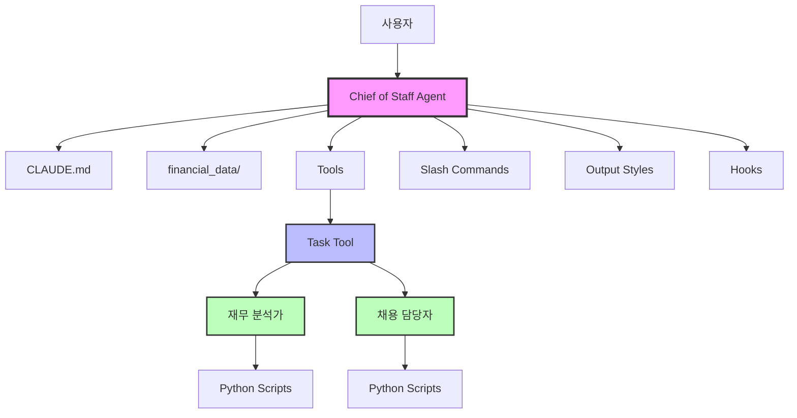
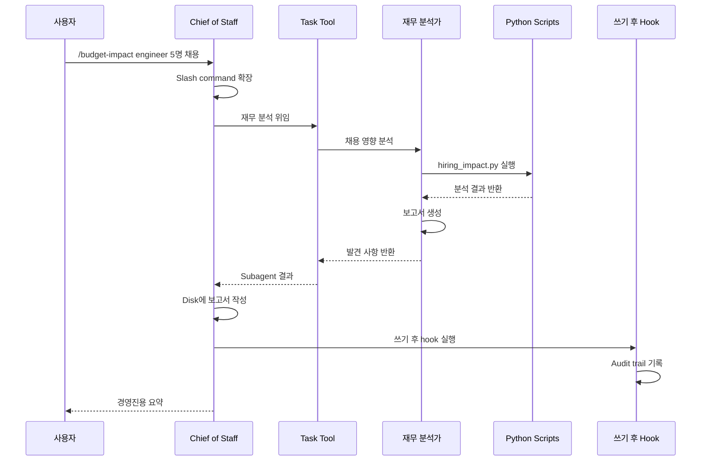

# Chief of Staff Agent Architecture

```mermaid
graph TD
    User[사용자] --> Chief[Chief of Staff Agent]
    Chief --> Memory[CLAUDE.md]
    Chief --> FinData[financial_data/]
    Chief --> Tools
    Chief --> Commands[Slash Commands]
    Chief --> Styles[Output Styles]
    Chief --> Hooks[Hooks]

    Tools --> Task[Task Tool]
    Task --> FA[재무 분석가]
    Task --> Recruiter[채용 담당자]

    FA --> Scripts1[Python Scripts]
    Recruiter --> Scripts2[Python Scripts]

    style Chief fill:#f9f,stroke:#333,stroke-width:3px
    style Task fill:#bbf,stroke:#333,stroke-width:2px
    style FA fill:#bfb,stroke:#333,stroke-width:2px
    style Recruiter fill:#bfb,stroke:#333,stroke-width:2px
```

## 예상 Agent 소통 흐름

```mermaid
sequenceDiagram
    participant User as 사용자
    participant Chief as Chief of Staff
    participant Task as Task Tool
    participant FA as 재무 분석가
    participant Scripts as Python Scripts
    participant Hooks as 쓰기 후 Hook
    User->>Chief: /budget-impact engineer 5명 채용
    Chief->>Chief: Slash command 확장
    Chief->>Task: 재무 분석 위임
    Task->>FA: 채용 영향 분석
    FA->>Scripts: hiring_impact.py 실행
    Scripts-->>FA: 분석 결과 반환
    FA->>FA: 보고서 생성
    FA-->>Task: 발견 사항 반환
    Task-->>Chief: Subagent 결과
    Chief->>Chief: Disk에 보고서 작성
    Chief->>Hooks: 쓰기 후 hook 실행
    Hooks->>Hooks: Audit trail 기록
    Chief-->>User: 경영진용 요약
```
