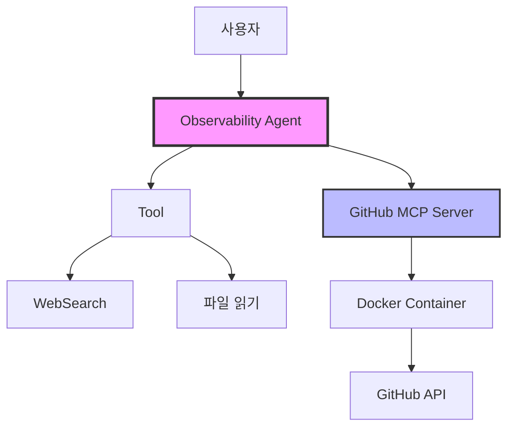
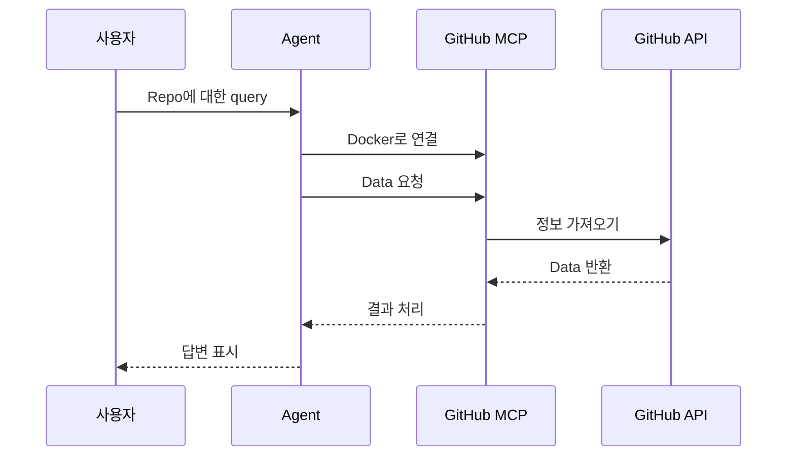

# Observability Agent Architecture

```mermaid
graph TD
    User[사용자] --> Agent[Observability Agent]
    Agent --> GitHub[GitHub MCP Server]

    Agent --> Tools[Tool]
    Tools --> WebSearch[WebSearch]
    Tools --> Read[파일 읽기]

    GitHub --> Docker[Docker Container]
    Docker --> API[GitHub API]

    style Agent fill:#f9f,stroke:#333,stroke-width:3px
    style GitHub fill:#bbf,stroke:#333,stroke-width:2px
```

# 소통 흐름 Diagram

```mermaid
sequenceDiagram
    participant User as 사용자
    participant Agent
    participant MCP as GitHub MCP
    participant API as GitHub API

    User->>Agent: Repo에 대한 query
    Agent->>MCP: Docker로 연결
    Agent->>MCP: Data 요청
    MCP->>API: 정보 가져오기
    API-->>MCP: Data 반환
    MCP-->>Agent: 결과 처리
    Agent-->>User: 답변 표시
```