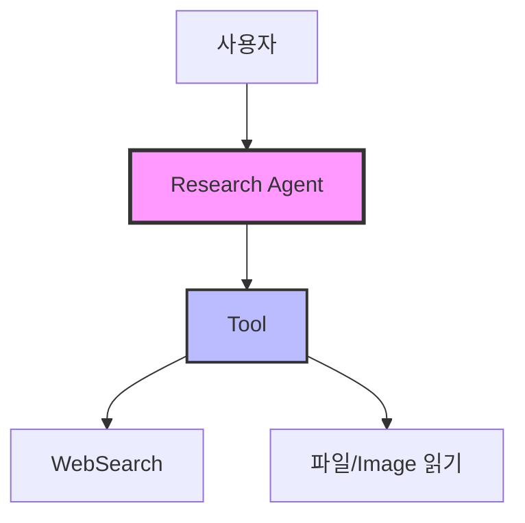
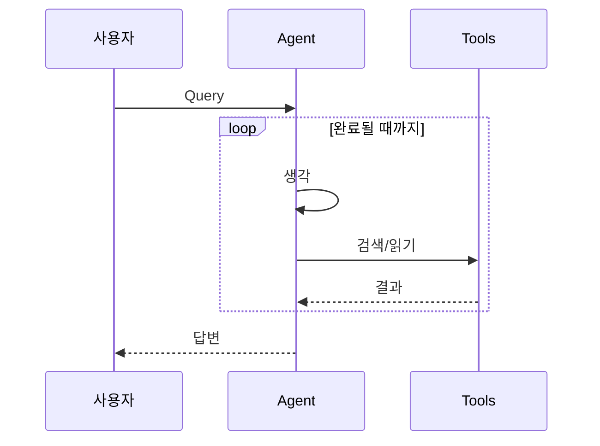

# Research Agent Architecture

```mermaid
graph TD
    User[사용자] --> Agent[Research Agent]
    Agent --> Tools[Tool]

    Tools --> WebSearch[WebSearch]
    Tools --> Read[파일/Image 읽기]

    style Agent fill:#f9f,stroke:#333,stroke-width:3px
    style Tools fill:#bbf,stroke:#333,stroke-width:2px
```

# 소통 흐름 Diagram

```mermaid
sequenceDiagram
    participant User as 사용자
    participant Agent
    participant Tools

    User->>Agent: Query

    loop 완료될 때까지
        Agent->>Agent: 생각
        Agent->>Tools: 검색/읽기
        Tools-->>Agent: 결과
    end

    Agent-->>User: 답변
```